# Log

> @Author：林观田201908010502

## Task 0: Getting Started

> 2022-06-22

- Launch WSL2

- Fork and git clone from the repostories [xv6-k210](https://github.com/abrasumente233/xv6-k210) on github.

  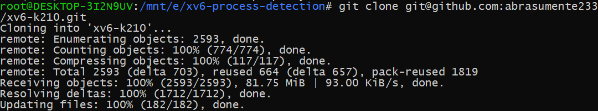

  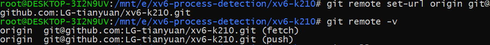

- environment configuration

  - ```shell
    $ sudo apt update && sudo apt install gcc-riscv64-unknown-elf
    $ sudo apt install qemu-system-misc
    $ sudo apt install dosfstools
    ```

- compile

  - ```shell
    $ make fs
    $ make run platform=qemu
    ```

  - result

    - 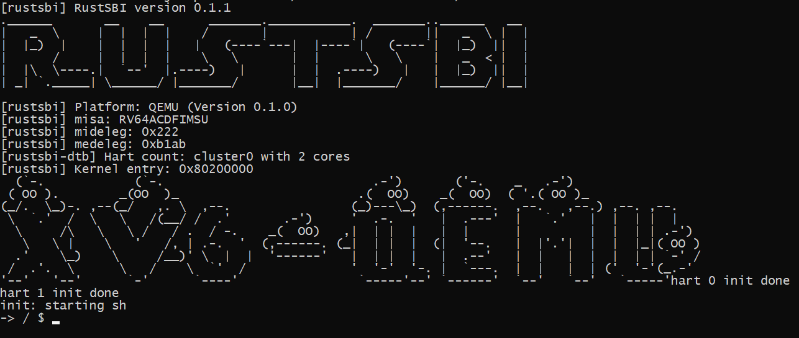

------

## Task 1 : Read the source files of xv6 and run it on K210

> 2022-06-22

### Note

- xv6 通常隐式地分配用户的内存空间。`fork` 在子进程需要装入父进程的内存拷贝时分配空间，`exec` 在需要装入可执行文件时分配空间。一个进程在需要额外内存时可以通过调用 `sbrk(n)` 来增加 n 字节的数据内存。 `sbrk` 返回新的内存的地址。
- 文件描述符和 `fork` 的交叉使用使得 I/O 重定向能够轻易实现。`fork` 会复制父进程的文件描述符和内存，所以子进程和父进程的文件描述符一模一样。`exec` 会替换调用它的进程的内存但是会保留它的文件描述符表。这种行为使得 shell 可以这样实现重定向：`fork` 一个进程，重新打开指定文件的文件描述符，然后执行新的程序。

------

## Task 2： Implement process related system calls

### syscall 1：getppid

> 2022-06-22

- 在xv6-user目录下

  - 在user.h文件中，添加新系统调用封装后的函数声明，假设其函数名为`getppid`。

    - ```c
      int getppid(void);
      ```

  - 在usys.pl文件末尾，添加如下行：

    - ```perl
      entry("getppid");
      ```

- 在kernel目录下

  - 在include/sysnum.h文件中，添加新系统调用号的宏定义：

    - ```c
      #define SYS_getppid     27
      ```

    - 其中，27为新的合法系统调用号

  - 在syscall.c文件中，添加功能函数的声明，并更新系统调用表：

    - ```c
      extern uint64 sys_getppid(void);
      
      static uint64 (*syscalls[])(void) = {
          ......
          [SYS_getppid]    sys_getppid,
      };
      
      static char *sysnames[] = {
          ......
          [SYS_getppid]     "getppid",
      };
      ```

  - 在sysproc.c文件中，实现`sys_getppid`函数的功能如下：

    - ```c
      uint64 sys_getppid(void)
      {
        return myproc()->parent->pid;
      }
      ```

- 在xv6-user目录下

  - 创建getppid.c文件，编写系统调用`getppid`的测试函数`test_getppid`如下：

    - ```c
      int test_getppid()
      {
      	int status;
      	int pid = fork();
      	if(pid > 0){
      		wait(&status);
      		int ppid = getpid();
      		printf("parent[%d]: child = %d\n", ppid, pid);
      	}else if(pid == 0){
      		int cpid = getpid();
      		int ppid = getppid();
      		printf("child[%d]: parent = %d\n", cpid, ppid);
      		exit(0);
      	}else{
      		printf("fork error\n");
      	}
      	return 0;
      }
      ```

- 在根目录下

  - 在Makefile文件中加一行如下：

    - ```makefile
      UPROGS=\
          $U/_init\
          $U/_sh\
          $U/_cat\
          ...
          $U/_getppid\
      ```

- 编译测试

  - ```shell
    $ make build
    $ make fs
    $ make run platform=qemu
    ```

  - 运行结果

    - 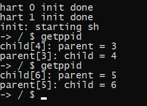

------

### syscall 2：times

#### 2.1 Stage 1 

> 2022-06-22
>
> 仅添加sys_times系统调用，功能未正确实现

- 在kernel目录下

  - 在include/types.h文件中，定义`clock_t`变量类型

    - ```c
      typedef uint64 clock_t;
      ```

  - 在include目录下创建`times.h`文件，并定义tms结构体

    - ```c
      #ifndef __TIMES_H
      #define __TIMES_H
      
      #include "types.h"
      
      struct tms {
      	uint64 utime; // user time (in seconds)
      	uint64 stime; // system time
      	uint64 cutime; // user time of children
      	uint64 cstime; // system time of children
      }
      
      #endif
      ```

- 在xv6-user目录下

  - 在user.h文件中，添加`times.h`头文件，声明`tms`结构体，添加新系统调用封装后的函数声明，假设其函数名为`times`。

    - ```c
      #include "kernel/include/times.h"
      struct tms;
      ...
      clock_t times(struct tms*);
      ```

  - 在usys.pl文件末尾，添加如下行：

    - ```perl
      entry("times");
      ```

- 在kernel目录下

  - 在include/sysnum.h文件中，添加新系统调用号的宏定义：

    - ```c
      #define SYS_times     28
      ```

    - 其中，27为新的合法系统调用号

  - 在syscall.c文件中，添加功能函数的声明，并更新系统调用表：

    - ```c
      extern uint64 sys_times(void);
      
      static uint64 (*syscalls[])(void) = {
          ......
          [SYS_times]    sys_times,
      };
      
      static char *sysnames[] = {
          ......
          [SYS_times]     "times",
      };
      ```

  - 在syscall.c文件中，实现`sys_times`函数的功能如下：（但该函数只返回自进程运行开始的总时间）

    - 参考链接：[https://github.com/kwrx/aplus-newlib/libgloss/riscv/sys_times.c](https://github.com/kwrx/aplus-newlib/blob/e5531943d5b997152d71eb5b7222c0c1d8b6919f/libgloss/riscv/sys_times.c)
    
    - ```c
      #include "include/times.h"
      ...
      uint64 sys_times(void)
      {
        uint64 addr;
        if (argaddr(0, &addr) < 0) {
          return -1;
        }
      
        struct tms* t = (struct tms*)addr;
      
        clock_t timeval;
      
        timeval = r_time();
        t->utime = timeval;
        t->stime = 0;
        t->cutime = 0;
        t->cstime = 0;
      
        return timeval;
      }
      ```
  
- 在xv6-user目录下

  - 创建times.c文件，编写系统调用`times`的测试函数`test_times`如下：
    - ```c
      #include "kernel/include/types.h"
      #include "kernel/include/times.h"
      #include "xv6-user/user.h"
      
      int test_times()
      {
      	struct tms t;
      	clock_t ticks = times(&t);
      	printf("the usertime of the process: %d\n",ticks);
      	printf("utime:%d,stime:%d,cutime:%d,cstime:%d\n",t.utime,t.stime,t.cutime,t.cstime);
      	return 0;
      }
      
      int main(void) {
      	test_times();
      	exit(0);
          return 0;
      }
      ```

- 在根目录下

  - 在Makefile文件中如下编译目标：

    - ```makefile
      UPROGS=\
          $U/_init\
          $U/_sh\
          $U/_cat\
          ...
          $U/_times\
      ```

  - 编译运行

    - 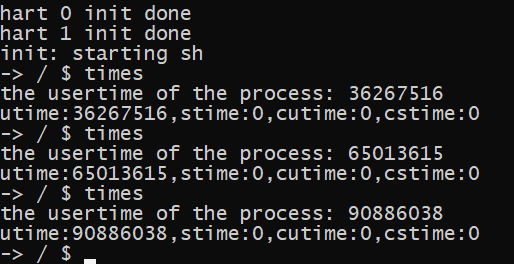

#### 2.2 Stage 2

> 2022-06-23 下午

> Question：如何分别计算进程的用户态时间、内核态时间、子进程的用户态时间、子进程的内核态时间？
>
> 已有条件：proc结构体中包含了一个parent指针
>
> 解决思路：
>
> ①往结构体中添加成员变量
>
> ②进程的用户态时间：陷入内核态时计算该时刻距离上一次离开内核态时的时间差，加入到总的用户态时间（上一次离开内核态时间初始化为0）
>
> ③进程的内核态时间：离开内核态时计算该时刻距离上一次进入内核态时的时间差，加入到总的内核态时间（上一次进入内核态时间初始化为0）、被操作系统调度而释放CPU时计算该时刻距离上一次进入内核态时的时间差
>
> ④进程的子进程的用户态、内核态时间：利用已有的parent指针，进程进入等待子进程状态时遍历系统中的所有进程，如果某个进程的父进程是当前进程，则用自己的用户态、内核态时间通过parent指针来更新父进程的子进程的用户态、内核态时间总和
>
> 参考：[https://gitlab.eduxiji.net/retrhelo/xv6-k210](https://gitlab.eduxiji.net/retrhelo/xv6-k210)

- 添加times.h和系统调用过程不变，修改系统调用如下

  - ```c
    uint64 sys_times(void)
    {
      uint64 addr;
      if (argaddr(0, &addr) < 0) {
        return -1;
      }
      struct tms* t = (struct tms*)addr;
      struct proc *p = myproc();
      clock_t timeval;
      timeval = r_time();
      t->utime = p->proc_tms.utime;
      t->stime = p->proc_tms.stime;
      t->cutime = p->proc_tms.cutime;
      t->cstime = p->proc_tms.cstime;
      return timeval;
    }
    ```

- 函数功能实现

  - 在proc.h文件中的proc进程结构体中添加如下成员变量，用于记录进程的用户态和内核态时间，以及记录进入内核态和离开内核态的时刻

    - ```c
      #include "times.h"
      struct proc{
      	...
      	// times for process performance 
      	struct tms proc_tms;
      	uint64 ikstmp;      // the last moment when entering kernel
      	uint64 okstmp;      // the last moment when leaving kernel
      	...
      }
      ```

  - 进程初始化时初始化该成员变量，将进程的所有时间记录值初始化为0

    - ```c
      void procinit(void)
      {
      	for(p = proc; p < &proc[NPROC]; p++) {
            initlock(&p->lock, "proc");
            // times for process performance 
            p->proc_tms.utime = 0;
            p->proc_tms.stime = 0;
            p->proc_tms.cutime = 0;
            p->proc_tms.cstime = 0;
            p->ikstmp = p->okstmp = 0;
            ...
          }
      }
      ```

  - 进程用户态时间计算，在trap.c中的`usertrap`函数中添加一下功能

    - ```c
      void usertrap(void)
      {
      	...
      	struct proc *p = myproc();
      	//calculate user time
      	uint64 temp = r_time(); //获取当前时刻
      	p->ikstmp = temp;	//记录当前时刻为进程最后一次陷入内核态的时间
      	p->proc_tms.utime += temp - p->okstmp;	//用户态时间加上当前时刻距离上一次离开内核态时的时间差
      	...
      }
      ```

  - 进程内核态时间计算，在trap.c中的`usertrapret`函数中以及proc.c中的`sched`函数添加一下功能

    - ```c
      void usertrapret(void)
      {
      	struct proc *p = myproc();
      	intr_off();
      	//calculate kernel time
      	uint64 temp = r_time(); //获取当前时刻
      	p->okstmp = temp;	//记录当前时刻为进程最后一次离开内核态（返回用户态）的时间
      	p->proc_tms.stime += temp - p->ikstmp;	//内核态时间加上当前时刻距离上一次陷入内核态时的时间差
      	...
      }
      
      void sched(void)
      {
          //被调度释放CPU时，内核态时间加上当前时刻距离上一次陷入内核态时的时间差
          p->proc_tms.stime += r_time() - p->ikstmp;
          ...
          p->ikstmp = r_time();
      }
      ```
    
  - 进程的子进程的用户态、内核态时间计算，在proc.c的`wait`函数添加一下功能

    - ```c
      int wait(uint64 addr)
      {
          struct proc *np;
          int havekids, pid;
      	struct proc *p = myproc();
          ...
        	for(;;){
              havekids = 0;
          	for(np = proc; np < &proc[NPROC]; np++){
                  if(np->parent == p){
                      // add child's tms time 
                      //用子进程的用户态、内核态时间更新父进程的内核态、用户态时间
                  	p->proc_tms.cstime += np->proc_tms.stime + np->proc_tms.cstime;
                      p->proc_tms.cutime += np->proc_tms.utime + np->proc_tms.cutime;
                  }
              }
          }
      }
      ```

- 在xv6-user目录下

  - 在times.c文件中，修改系统调用`times`的测试函数`test_times`如下：

    - ```c
      int test_times()
      {
      	struct tms t;
      	int status;
      	int pid = fork();
      	if(pid > 0){
      		wait(&status);
      		clock_t ticks = times(&t);
      		printf("parent process:\n");
      		printf("the total time form timer counter: %d\n",ticks);
      		printf("utime:%d,stime:%d,cutime:%d,cstime:%d\n",t.utime,t.stime,t.cutime,t.cstime);
      	}else if(pid == 0){
      		printf("Hello from child process!\n");
      		exit(0);
      	}else{
      		printf("fork error\n");
      	}
      	return 0;
      }
      ```

  - 编译运行

    - 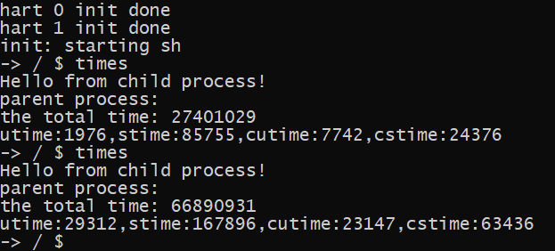

#### 2.3 Stage 3

> 2022-08-26
>
> 修改：times的实现由原来的通过r_time()函数读取timer counter的值改为通过实时读取系统中的ticks来计算时间，从而实现所有时间以clock ticks的形式表示。（同时方便后续`ps`命令的实现）

- 修改实现代码如下

  - ```c
    //trap.c
    void usertrap(void)
    {
    	...
    	struct proc *p = myproc();
    	//calculate user time
    	acquire(&tickslock);
      	uint64 temp = ticks;//获取当前时刻
      	release(&tickslock);
    	p->ikstmp = temp;	//记录当前时刻为进程最后一次陷入内核态的时间
    	p->proc_tms.utime += temp - p->okstmp;	//用户态时间加上当前时刻距离上一次离开内核态时的时间差
    	...
    }
    void usertrapret(void)
    {
    	struct proc *p = myproc();
    	intr_off();
    	//calculate kernel time
    	acquire(&tickslock);
      	uint64 temp = ticks;//获取当前时刻
      	release(&tickslock);
    	p->okstmp = temp;	//记录当前时刻为进程最后一次离开内核态（返回用户态）的时间
    	p->proc_tms.stime += temp - p->ikstmp;	//内核态时间加上当前时刻距离上一次陷入内核态时的时间差
    	...
    }
    //proc.c
    void sched(void)
    {
        ...//被调度释放CPU时，内核态时间加上当前时刻距离上一次陷入内核态时的时间差
      	acquire(&tickslock);
      	uint temp = ticks;
      	release(&tickslock);
      	p->proc_tms.stime += temp - p->ikstmp;
        
      	intena = mycpu()->intena;
      	swtch(&p->context, &mycpu()->context);
      	mycpu()->intena = intena;
    
      	acquire(&tickslock);
      	p->ikstmp = ticks;
      	release(&tickslock);
        ...
    }
    void forkret(void)
    {
        ...
        acquire(&tickslock);
      	myproc()->ikstmp = ticks;//fork返回时，记录当前时刻为进程最后一次陷入内核态的时间
      	release(&tickslock);
      	usertrapret();
    }
    ```

- 注意：因为系统当中的被杀掉的进程可能会被重新分配，因此在释放进程时需重置各种时间记录（之前忽略的地方）

  - ```c
    static void freeproc(struct proc *p)
    {
        ...
        p->proc_tms.utime = 0;
      	p->proc_tms.stime = 0;
      	p->proc_tms.cutime = 0;
      	p->proc_tms.cstime = 0;
      	p->starttime = 0;
    }
    ```

- 修改测试函数如下

  - ```c
    int test_times()
    {
    	struct tms t;
    	int status;
    	int pid = fork();
    	if(pid > 0){
    		wait(&status);//等待子进程结束
            sleep(10);//父进程睡眠1s
    		clock_t ticks = times(&t);
    		printf("parent process:\n");
    		printf("the total time form timer counter: %d\n",ticks);
    		printf("utime:%d,stime:%d,cutime:%d,cstime:%d\n",t.utime,t.stime,t.cutime,t.cstime);
    	}else if(pid == 0){
    		printf("Hello from child process!\n");
            sleep(50);//子进程睡眠5s
    		exit(0);
    	}else{
    		printf("fork error\n");
    	}
    	return 0;
    }
    ```

- 编译运行

  - 使用`r_time`计时，输出的结果单位为时钟周期数
    - 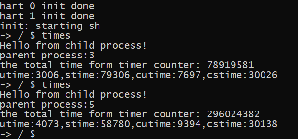
  - 使用`ticks`计时（由于1s≈10ticks，而进程的实际运行时间很小，如上图，因此以tick为单位输出时为0）
    - 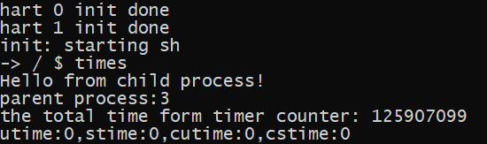

------

### syscall 3：getmem

> 2022-06-23 上午

- 在xv6-user目录下

  - 在user.h文件中，添加新系统调用封装后的函数声明，假设其函数名为`getmem`。

    - ```c
      int getmem(void);
      ```

  - 在usys.pl文件末尾，添加如下行：

    - ```perl
      entry("getmem");
      ```

- 在kernel目录下

  - 在include/sysnum.h文件中，添加新系统调用号的宏定义：

    - ```c
      #define SYS_getmem     29
      ```

    - 其中，29为新的合法系统调用号

  - 在syscall.c文件中，添加功能函数的声明，并更新系统调用表：

    - ```c
      extern uint64 sys_getmem(void);
      
      static uint64 (*syscalls[])(void) = {
          ......
          [SYS_getmem]    sys_getmem,
      };
      
      static char *sysnames[] = {
          ......
          [SYS_getmem]     "getmem",
      };
      ```

    - 在sysproc.c文件中，实现`sys_getmem`函数的功能如下：

      - ```c
        uint64 sys_getmem(void)
        {
          return myproc()->sz/1024;
        }
        ```

- 在xv6-user目录下

  - 创建getmem.c文件，编写系统调用`getmem`的测试函数`test_getmem`如下：

    - ```c
      #include "xv6-user/user.h"
      
      int test_getmem()
      {
      	int size = getmem();
      	printf("the virtual memory size of the process is %d\n",size);
      	char* str = malloc(20);
      	size = getmem();
      	strcpy(str,"hello world!");
      	printf("after malloc with size of %d: %d\n",strlen(str),size);
      	return 0;
      }
      
      int main(void) {
      	test_getmem();
      	exit(0);
          return 0;
      }
      ```

- 在根目录下

  - 在Makefile文件中如下编译目标：

    - ```makefile
      UPROGS=\
          $U/_init\
          $U/_sh\
          $U/_cat\
          ...
          $U/_getmem\
      ```

  - 编译运行
    - 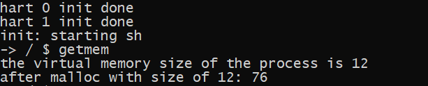

------

### [Bonus] syscall 4：clone


------

## Task 3: Add signals to xv6

### syscall 1: alarm

> 2022-06-24

- 在xv6-user目录下

  - 在user.h文件中，添加新系统调用封装后的函数声明，其函数名为`alarm`。

    - ```c
      uint alarm(uint seconds);
      ```

  - 在usys.pl文件末尾，添加如下行：

    - ```perl
      entry("alarm");
      ```

- 在kernel目录下

  - 在include/sysnum.h文件中，添加新系统调用号的宏定义：

    - ```c
      #define SYS_alarm     30
      ```

    - 其中，30为新的合法系统调用号

  - 在syscall.c文件中，添加功能函数的声明，并更新系统调用表：

    - ```c
      extern uint64 sys_alarm(void);
      
      static uint64 (*syscalls[])(void) = {
          ......
          [SYS_alarm]    sys_alarm,
      };
      
      static char *sysnames[] = {
          ......
          [SYS_alarm]     "alarm",
      };
      ```

  - 在proc.h文件的proc结构体中添加成员变量如下，并在proc.c中进程初始化时初始化为0。

    - ```c
      struct proc{
          ...
          uint64 ticks;
      	uint64 alarm;
      }
      ```

    - ```c
      void procinit(){
          ...
          p->ticks = 0;
          p->alarm = 0;
          ...
      }
      ```

  - 新建signal.h文件，定义宏`#define SIGALRM 14`。

  - 在sysproc.c文件中，实现`sys_alarm`函数的功能如下：

    - ```c
      //param.h
      #define TICKS_FREQ	10
      
      uint64 sys_alarm(void)
      {
        int seconds;
        if(argint(0, &seconds) < 0)
          return -1;
        struct proc* p = myproc();
        //转化为时钟中断数，乘以当前系统每秒时钟中断次数
        p->alarm = seconds*TICKS_FREQ/2;
        return 0;
      }
      ```

  - 在trap.c中，利用**时钟中断**来计时，每时间中断一次，`timer.c`中的`ticks`计时器自增一次，时钟中断间隔为0.2s，在`usertrap`函数中通过`devintr`函数返回值判断是否为时钟中断，如果返回值为2，则表明时间中断一次。

    - ```c
      void usertrap(void)
      {
          ...
          if(r_scause() == 8){
              ...
          }
          else if((which_dev = devintr()) != 0){
              if(which_dev == 2){ //clock interrupt
                  if(p->alarm > 0){
                    p->alarm--;
                    if(p->alarm == 0){
                      p->killed = SIGALRM;
                      p->ticks = 0;
                      // kill(p->pid);
                    }
                  }
              }
        	} 
        	else{
              ...
          }
          ...
      }
      ```

- 在xv6-user目录下

  - 创建alarm.c文件，编写系统调用`alarm`的测试函数`test_alarm`如下：

    - ```c
      int test_alarm()
      {
        printf("Alarm testing!\n");
        alarm(5);   // send SIGALARM to calling process after 5 seconds, which means terminating it
        while(1);   // process suspended, waiting for signals to wake up
        printf("unreachable!");
        return 0;
      }
      ```

- 在根目录下

  - 在Makefile文件中如下编译目标：

    - ```makefile
      UPROGS=\
          $U/_init\
          $U/_sh\
          $U/_cat\
          ...
          $U/_alarm\
      ```

  - 编译运行

    - 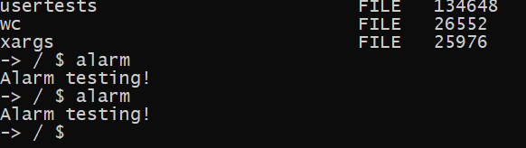

------

### syscall 2: pause

> 2022-06-24

- 在xv6-user目录下

  - 在user.h文件中，添加新系统调用封装后的函数声明，假设其函数名为`pause`。

    - ```c
      void pause(void);
      ```

  - 在usys.pl文件末尾，添加如下行：

    - ```perl
      entry("pause");
      ```

- 在kernel目录下

  - 在include/sysnum.h文件中，添加新系统调用号的宏定义：

    - ```c
      #define SYS_pause     31
      ```

    - 其中，31为新的合法系统调用号

  - 在syscall.c文件中，添加功能函数的声明，并更新系统调用表：

    - ```c
      extern uint64 sys_pause(void);
      
      static uint64 (*syscalls[])(void) = {
          ......
          [SYS_pause]    sys_pause,
      };
      
      static char *sysnames[] = {
          ......
          [SYS_pause]     "pause",
      };
      ```

  - 在sysproc.c文件中，实现`sys_pause`函数的功能如下。参考`sys_sleep`的函数实现，当接收到signal信号时被唤醒。并修改`sys_alarm`函数。

    - ```c
      uint64 sys_alarm(void)
      {
        int seconds;
        if(argint(0, &seconds) < 0)
          return -1;
        struct proc* p = myproc();
        acquire(&tickslock);
        p->ticks = ticks; //在proc中增加成员变量ticks，表示调用alarm时系统的当前ticks值
        release(&tickslock);
        p->alarm = seconds*TICKS_FREQ/2;
        return 0;
      }
      
      uint64 sys_pause(void)
      {
        struct proc* p = myproc();
        printf("pause: waiting for signal to wake up!\n");
        acquire(&tickslock);
        while(p->killed == 0){
          sleep(&ticks, &tickslock);
        }
        release(&tickslock);
        return 0;
      }
      ```
    
  - 在proc.c文件的`scheduler`函数中，添加如下调度条件判断，如果某个进程在`pause()`前调用了`alarm()`,则通过判断处于睡眠的进程是否需要计时（即p->alarm>0），利用系统的计时器和进程开始时的系统时间计算是否已经超时，如果是，则向该进程发送`SIGALRM`信号。而对于`SIGINT`信号，则通过后面的`console.c`实现。
  
    - ```c
      void scheduler(void){
          ...
          if(p->state == RUNNABLE ) {
              ...
          }else if(p->state == SLEEPING && p->alarm > 0){
              uint xticks;
              acquire(&tickslock);
              xticks = ticks;
              release(&tickslock);
              if(p->ticks + p->alarm*2 <= xticks){
                  p->killed = SIGALRM;
                  p->ticks = 0;
                  p->alarm = 0;
              }
          }
          ...
      }
      ```

------

### syscall 3: signal

#### 3.1 step 1

> 2022-06-25

- 通过进程的成员变量`killed`来标识进程当前接收到的信号

- 在xv6-user目录下

  - 在user.h文件中，添加新系统调用封装后的函数声明，假设其函数名为`signal`。

    - ```c
      void (*signal(int sig, void (*func)(int)))(int);
      ```

  - 在usys.pl文件末尾，添加如下行：

    - ```perl
      entry("signal");
      ```

- 在kernel目录下

  - 在include/sysnum.h文件中，添加新系统调用号的宏定义：

    - ```c
      #define SYS_signal     32
      ```

    - 其中，32为新的合法系统调用号

  - 在syscall.c文件中，添加功能函数的声明，并更新系统调用表：

    - ```c
      extern uint64 sys_signal(void);
      
      static uint64 (*syscalls[])(void) = {
          ......
          [SYS_signal]    sys_signal,
      };
      
      static char *sysnames[] = {
          ......
          [SYS_signal]     "signal",
      };
      ```

  - 在signal.h文件中增加宏定义、结构体和函数，并在signal.c中增加函数的定义

    - ```c
      #define SIGTERM 	15	//增加一种信号作为kill进程的标记，并修改进程终止的条件
      #define SIGALRM		14
      #define SIGINT 		2
      
      #define SIG_DEF		((void(*)(int))1)
      #define SIG_IGN		((void(*)(int))2)
      
      typedef void (*func)(int);
      
      struct sigaction{
      	uint64 sig;	//存储信号类型
      	func handler;	//存储信号对应的处理方法，SIG_DEF/SIG_IGN/handler_address
      };
      
      void sighandle(void);
      
      /*
      对于SIGALRM：handler取值SIG_DEF时为超时后发送信号给进程直接kill
      对于SIGINT：handler取值SIG_DEF时为直接kill
      */
      ```
      
    - ```c
      void sighandle(void)
      {
      	struct proc *p = myproc();
      	int signum = p->killed;
      	int i = 0;
      	for(i=0;i<2;i++){
      		if(signum == p->sigact[i].sig){
      			if(p->sigact[i].handler == SIG_DEF){
      				exit(-1);
      			}else if(p->sigact[i].handler == SIG_IGN){
                      p->killed = 0;
      				break;
      			}else{	//step2
                  }
      		}
      	}
      }
      ```
    
  - 在proc.h文件的proc结构体中添加成员变量如下，并在proc.c中进程初始化时进行初始化。
  
    - ```c
      //signal，本实验只要求实现两种信号及其处理，因此声明数组大小为2
      struct sigaction sigact[2];
      ```
  
    - ```c
      void procinit(){
          ...
          p->sigact[0].sig = SIGALRM;
          p->sigact[0].handler = SIG_DEF;
          p->sigact[1].sig = SIGINT;
          p->sigact[1].handler = SIG_DEF;
          ...
      }
      ```
  
  - 在sysproc.c文件中，实现`sys_signal`函数的功能如下
  
    - ```c
      uint64 sys_signal(void)
      {
        uint64 sig;
        func handler;
        if (argaddr(0, &sig) < 0 || argaddr(1, (uint64*)&handler) < 0) {
          return -1;
        }
        //printf("signal:%d,%d\n",sig,handler);
        struct proc* p = myproc();
        int i = 0;
        for(i=0;i<2;i++){
          if(sig == p->sigact[i].sig){
            p->sigact[i].handler = handler;
            break;
          }
        }
        return 0;
      }
      ```
    
  - 在proc.c文件的usertrap函数中修改对信号的处理如下
  
    - ```c
      void
      usertrap(void)
      {
        ...
        if(r_scause() == 8){
          if(p->killed == SIGTERM)
            exit(-1);
          ...
        } 
        else if((which_dev = devintr()) != 0){
          ...
        } 
        else {
          ...
          p->killed = SIGTERM;
        }
        if(p->killed){
          if(p->killed == SIGTERM)
            exit(-1);
          sighandle();
        }
        ...
      }
      ```
  
- 在xv6-user目录下

  - 创建alarmtest2.c文件，编写系统调用`alarm`的测试函数`test_alarm`如下：

    - ```c
      int test_alarm()
      {
        printf("Alarm testing!\n");
        alarm (5);
        printf("Waiting for alarm to go off\n");
        (void) signal ( SIGALRM, SIG_DEF ); //test1
        //(void) signal ( SIGALRM, SIG_IGN ); //test2
        pause();      //process suspended, waiting for signals to wake up
        printf("now reachable!\n");
        return 0;
      }
      ```

- 在根目录下

  - 在Makefile文件中如下编译目标：

    - ```makefile
      UPROGS=\
          $U/_init\
          $U/_sh\
          $U/_cat\
          ...
          $U/_alarmtest2\
      ```

  - 编译运行

    - test1

      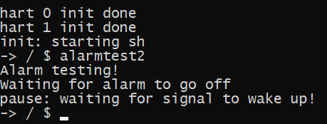

    - test2

      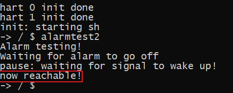

#### 3.2 step 2

> 2022-06-26

- 在kernel目录下

  - 在signal.c中修改`sighandle`函数的定义，修改`p->trapframe->epc`，当进程返回用户态时首先执行信号处理函数，下一次陷入内核时通过`r_sepc()`恢复到原来的epc。

    - ```c
      void sighandle(void)
      {
      	struct proc *p = myproc();
      	int signum = p->killed;
      	int i = 0;
      	for(i=0;i<2;i++){
      		if(signum == p->sigact[i].sig){
      			if(p->sigact[i].handler == SIG_DEF){
                      exit(-1);
      			}else if(p->sigact[i].handler == SIG_IGN){
                      p->killed = 0;
      				break;
      			}else{	//step2
                      //当进程返回用户态时，从epc所指向的地址处开始执行，并通过a0传递处理函数的参数
                      p->trapframe->epc = (uint64)p->sigact[i].handler;
                      p->trapframe->a0 = p->killed;
      				p->killed = 0;
                  }
      		}
      	}
      }
      ```
  
- 在xv6-user目录下

  - 创建alarmtest3.c文件，编写系统调用`alarm`的测试函数`test_alarm`如下：

    - ```c
      void ding (int sig)
      {
        printf("[%d] Alarm has gone off\n",sig);
      }
      int test_alarm()
      {
        printf("Alarm testing!\n");
        alarm (5);
        printf("Waiting for alarm to go off\n");
        (void) signal ( SIGALRM, ding );
        pause();      //process suspended, waiting for signals to wake up
        printf("now reachable!\n");
        return 0;
      }
      ```
  
- 在根目录下

  - 在Makefile文件中如下编译目标：

    - ```makefile
      UPROGS=\
          $U/_init\
          $U/_sh\
          $U/_cat\
          ...
          $U/_alarmtest3\
      ```

  - 编译运行

    - tips：SIGALARM的值定义为14
    - 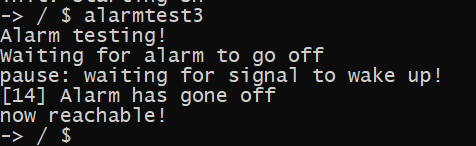

------

### syscall：kill

> 2022-06-27

- 在kernel目录下

  - 在proc.h文件中修改`kill(int)`函数声明，并在proc.c文件中修改该函数的定义。

    - ```c
      //proc.h
      int             kill(int,int);
      //proc.c
      int kill(int pid, int sig)
      {
        ...
            p->killed = sig;
        ...
      }
      ```

  - 在sysproc.c文件中修改系统调用`sys_kill()`函数的的定义

    - ```c
      uint64 sys_kill(void)
      {
        int pid,sig;
        if(argint(0, &pid) < 0 || argint(0, &sig) < 0)
          return -1;
        return kill(pid,sig);
      }
      ```

  - 修改该目录下所有文件中的`kill()`调用

- 在xv6-user目录下

  - 在user.h文件中，修改kill系统调用封装后的函数声明

    - ```c
      int kill(int pid,int sig);
      ```

  - 修改kill的测试函数以及该目录下其他文件中的`kill()`调用

    - ```c
      #include "kernel/include/signal.h"
      ...
      int main(int argc, char **argv)
      {
        ...
          kill(atoi(argv[i]),SIGTERM);
        ...
      }
      ```

------

### Ctrl-C sends SIGINT to the foreground process

> 2022-06-27

- 在kernel目录下

  - 在proc.h文件中增加`procint()`函数声明，并在proc.c文件中增加该函数的定义。

    - 如果是后台进程，sh程序在调用exec执行程序时会调用两次fork，通过子进程的子进程来执行程序，同时第一次的fork的子进程再fork第二个子进程后会直接退出，这是执行程序的子进程交由操作系统来管理，因此当前子进程的父进程是操作系统，其ppid值是1。而前台进程由于是通过第一次fork的子进程，其ppid值为sh的pid值。据此可以在按下Crtl-C时杀掉前台进程。
  
    - ```c
      void procint(void)
      {
        int flag = 0;
        struct proc *p;
        for(p = proc; p < &proc[NPROC]; p++){
            if(p->pid > 2 && p->parent->pid == 2 ){ 
              if(p->state == RUNNING || p->state == RUNNABLE || p->state == SLEEPING){
                kill(p->pid,SIGINT);
                flag = 1;
              }
            }
        }
        if(!flag){
          printf("\n-> / $ ");
        }
      }
      ```
  
  - 在console.c文件中修改`consoleintr()`函数，添加对硬件中断`Ctrl-C`的处理。
  
    - ```c
      void consoleintr(int c)
      {
        ...
        switch(c){
        case C('C'):
          procint();
          break;
        ...
        }
      }
      ```
    
  - 编译运行
  
    - 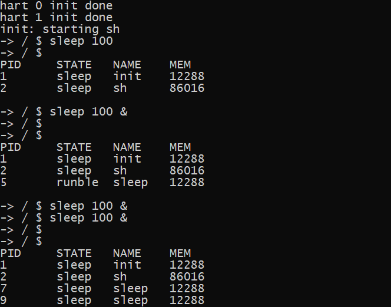

------

## Task 4: Implement the `/proc` pseudo-filesystem4

### #1 ls

> 2022-08-23~2022-08-25
>
> Implement：实现/proc虚拟文件系统以及命令`ls /proc`、`ls /proc/[pid]`、`ls /proc/[pid]/stat`。
>
> 实现思路：在dirent层（原inode层）实现虚拟文件系统，当通过`ls`或`cat`命令查询`/proc`文件系统的相关信息时，实时根据操作系统中当前运行的进程信息为每个运行的进程分配`dirent`并将其与`/proc`目录项的`dirent`结构体建立关联信息（通过`dirent`结构体中的`parent`指针建立联系），具体来讲，为每个运行进程通过分配新申请的`dirent`生成一个目录条目和一个文件条目。

- 相关辅助函数声明与定义

  - ```c
    //string.h
    void   			itoa(uint n, char *s); //int to array,用于将pid转换成字符数组形式
    int 			atoi(const char* str);//array to int
    //string .c
    void itoa(uint n, char* s)
    {
      int i, sign;       
      if ((sign = n) < 0)  
        n = -n;          
      i = 0;
      do {       
        s[i++] = n % 10 + '0';   
      } while ((n /= 10) > 0); 
      if (sign < 0)
        s[i++] = '-';
      s[i] = '\0';
      int  j;
      char c;             
      for (i = 0, j = strlen(s)-1; i<j; i++, j--) {
        c = s[i];
        s[i] = s[j];
        s[j] = c;
      }
    }
    int atoi(const char* str)
    {
      int s=0;
      int flag=0;  
      while(*str==' ')
      {
        str++;
      }
      if(*str=='-'||*str=='+')
      {
        if(*str=='-')
        flag=1;
        str++;
      }
      while(*str>='0'&&*str<='9')
      {
        s=s*10+*str-'0';
        str++;
        if(s<0)
        {
          s=2147483647;
          break;
        }
      }
      return s*(flag?-1:1);
    }
    ```

  - ```c
    //proc.h
    int             getPids(int*);//get the array of pid of running processes
    int             checkPid(int);//check the state of specified processes, alive or not
    //proc.c
    int getPids(int* pids)
    {
      struct proc *p;
      int cnt = 0;
      for(p = proc; p < &proc[NPROC]; p++) {
        if(p->state != ZOMBIE && p->state != UNUSED) {
          pids[cnt++] = p->pid;
        } 
      }
      return cnt;
    }
    int checkPid(int pid)
    {
      struct proc *p;
      for(p = proc; p < &proc[NPROC]; p++) {
        if(pid == p->pid)
        {
          if(p->state != ZOMBIE && p->state != UNUSED)
            return 1;
          return 0;
        }
      }
      return 0;
    }
    ```

  - ```c
    //fat32.h
    struct dirent*  ealloc_inmemory(struct dirent *dp, char *name, int attr);//modified from ealloc, allocate an entry in memory but not on disk，在dp目录下新建一个名为name的子目录
    struct dirent*  deget(struct dirent *parent, char *name);//间接调用eget函数，检查parent目录是否包含有名为name的子目录
    //fat32.c
    struct dirent *ealloc_inmemory(struct dirent *dp, char *name, int attr)
    {
        if (!(dp->attribute & ATTR_DIRECTORY)) {
            panic("ealloc not dir");
        }
        if (dp->valid != 1 || !(name = formatname(name))) {        // detect illegal character
            return NULL;
        }
        struct dirent *ep;
        uint off = 0;
        if ((ep = dirlookup(dp, name, &off)) != 0) {      // entry exists
            return ep;
        }
        ep = eget(dp, name);
        elock(ep);
        ep->attribute = attr;
        ep->file_size = 0;
        ep->first_clus = 0;
        ep->parent = edup(dp);
        ep->off = off;
        ep->clus_cnt = 0;
        ep->cur_clus = 0;
        ep->dirty = 0;
        strncpy(ep->filename, name, FAT32_MAX_FILENAME);
        ep->filename[FAT32_MAX_FILENAME] = '\0';
        if (attr == ATTR_DIRECTORY) {    
            ep->attribute |= ATTR_DIRECTORY;
        } else {
            ep->attribute |= ATTR_ARCHIVE;
        }
        ep->valid = 1;
        eunlock(ep);
        return ep;
    }
    
    struct dirent *deget(struct dirent *parent, char *name)
    {
        return eget(parent, name);
    }
    ```

- 重要函数分析：`eget`

  - `eget`函数首先根据给定的父目录的dirent和子目录的name，通过遍历ecache中的dirent来判断ecache中是否已经存在父目录dirent已包含名为name的子目录，如果存在则直接返回子目录的dirent，如果不存在，这新分配一个dirent给子目录，并将该dirent与父目录的dirent建立关系，从而避免了对同一目录下同一名字的子目录的重复分配造成内存浪费等问题。

- 在执行`ls /proc`或`ls /proc/[pid]`时实时为每个进程分配dirent并建立关系。

  - 分析`ls`命令相关的系统调用

    - 系统调用1：open，根据给定的路径查询文件信息并获得相应的文件描述符
    - 系统调用2：fstat，根据文件描述符获取文件的基本信息
    - 系统调用3：readdir（readdir -> sys_readdir -> dirnext），根据给定文件描述符及其dirent等信息，依次从磁盘中读取该目录下的子目录信息。

  - Attention：打印/proc文件夹下的目录信息此处的实现是在内核中完成，实际上也可以通过实现逐一读取/proc目录下的dirent信息的方法，来实现将目录信息传递回用户态打印。

  - ```c
    //file.c
    int dirnext(struct file *f, uint64 addr)
    {
      if(f->readable == 0 || !(f->ep->attribute & ATTR_DIRECTORY))
        return -1;
    
      struct dirent de;
      struct stat st;
      int count = 0;
      int ret;
      elock(f->ep);
      //通过enext依次读取目录项下的子目录信息，通过f->off标记下一次从哪里开始读
      while ((ret = enext(f->ep, &de, f->off, &count)) == 0) {  // skip empty entry
        f->off += count * 32;
      }
      eunlock(f->ep);
      if (ret == -1)
      {
        if(strncmp(f->ep->filename, "proc", 4) == 0) //若是"ls /proc"，首先遍历完proc文件夹存储在磁盘中的‘.’，‘..’两个条目（通过上面的enext），然后在末尾处打印相应的进程信息
        {
          int pids[NPROC];
          int cnt = getPids(pids);
          int i = 0;
          for(i = 0; i < cnt; i++)
          {
            printf("%d\t\t\t\t DIR \t0\n",pids[i]);
          }
        }
        else if(strncmp(f->ep->parent->filename, "proc", 4) == 0)//若是"ls /proc/[pid]"，首先在ecache中找到该进程文件夹下对应的文件stat的dirent，然后打印信息（规定每个进程的文件下只包含一个名为stat的文件）
        {
          struct dirent *sep = deget(f->ep,"stat");
          if(sep != NULL)
          {
            printf("%s\t\t\t\t FILE\t0\n",sep->filename);
          }
        }
        return 0;
      }
    
      f->off += count * 32; //计数，为读取下一个子目录
      estat(&de, &st);//获取文件信息
      // if(copyout(p->pagetable, addr, (char *)&st, sizeof(st)) < 0)
      if(copyout2(addr, (char *)&st, sizeof(st)) < 0)
        return -1;
      return 1;
    }
    ```

  - ```c
    //fat32.c
    //lookup_path：根据路径查找文件(夹)的或其父目录的dirent
    static struct dirent *lookup_path(char *path, int parent, char *name)
    {
        struct dirent *entry, *next;
        if (*path == '/') { //begin at the root dir
            entry = edup(&root);
        } else if (*path != '\0') { //begin at the current dir
            entry = edup(myproc()->cwd);
        } else {
            return NULL;
        }
        while ((path = skipelem(path, name)) != 0) { //path segmentation
            elock(entry);
            if (!(entry->attribute & ATTR_DIRECTORY)) { //if not directory
                eunlock(entry);
                eput(entry);
                return NULL;
            }
            if (parent && *path == '\0') { //if has parent and not current dir
                eunlock(entry);
                return entry;
            }
            if ((next = dirlookup(entry, name, 0)) == 0) {
                //to fill the situation of "-> /proc $ ls [pid of current proccess]"
                if(strncmp(entry->filename,"proc",4) == 0 && name[0] > '0' && name[0] <= '9')
                {
                    int pid = atoi(name);
                    int flag = checkPid(pid);
                    if(flag){
                        struct dirent *tmp;
                        tmp = ealloc_inmemory(entry,name,ATTR_DIRECTORY);
                        tmp->e_func = &procfs_e_func;
                        ealloc_inmemory(tmp,"stat",ATTR_ARCHIVE);
                        next = tmp;
                    }else{
                        eunlock(entry);
                        eput(entry);
                        return NULL;
                    }
                }else{
                    eunlock(entry);
                    eput(entry);
                    return NULL;
                }
            }
            eunlock(entry);
            eput(entry);
            //若是"ls /proc"，在ecache中为每个进程分配dirent并建立关系（为了减少代码执行次数，分情况执行）
            if(strncmp(name,"proc",4) == 0 && path[0] == '\0' ||
              (strncmp(entry->filename,"proc",4) == 0 && strncmp(name,".",3) == 0)){// ls /proc
                int pids[NPROC];
                int cnt = getPids(pids);
                int i = 0;
                for(i = 0; i < cnt; i++)
                {
                    char dirname[32];
                    struct dirent *tmp;
                    itoa(pids[i],dirname);
                    tmp = ealloc_inmemory(next,dirname,ATTR_DIRECTORY);
                    tmp->e_func = &procfs_e_func;
                    ealloc_inmemory(tmp,"stat",ATTR_ARCHIVE);
                }
            }
            //若是“ls /proc/[pid]”，实时分配或查找该进程对应的dirent
            else if((strncmp(name,"proc",4) == 0 && path[0] != '\0')){ 
                int pid = atoi(path);
                int flag = checkPid(pid);
                if(flag){
                    char dirname[32];
                    struct dirent *tmp;
                    itoa(pid,dirname);
                    tmp = ealloc_inmemory(next,dirname,ATTR_DIRECTORY);
                    tmp->e_func = &procfs_e_func;
                    ealloc_inmemory(tmp,"stat",ATTR_ARCHIVE);
                }else{
                    return NULL;
                }
            }
            else if(strncmp(next->parent->filename,"proc",4) == 0) //判断要查询的进程是否已经被killed
            {
                int pid = atoi(next->filename);
                int flag = checkPid(pid);
                if(!flag)
                    return NULL;
            }
            entry = next;
        }
        if (parent) {
            eput(entry);
            return NULL;
        }
        return entry;
    }
    ```
    
  - 编译运行
  
    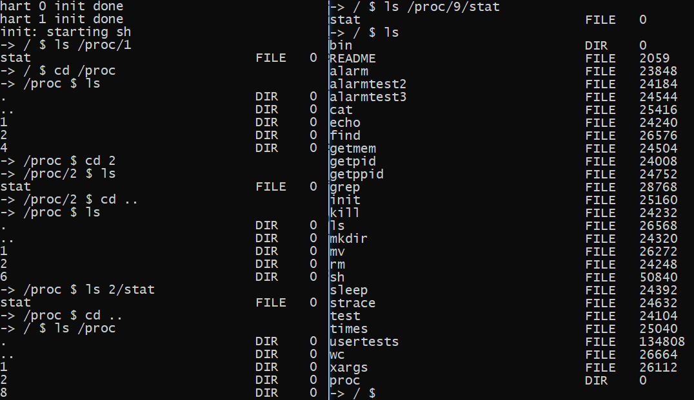

> 2022-08-29
>
> 修改ls的实现，通过实现逐一读取/proc目录下存在ecache中的dirent信息来实现将进程目录信息传递回用户态打印。

- 在dirent中添加成员变量child_index，表示某一时刻已获取的子目录项个数。

  - ```c
    //fat32.h
    struct dirent{
        ...
        int child_index;
    }
    ```

- 修改前面所定义的eget函数为procfs_enext函数，用于逐一读取指定目录下的子目录项。

  - ```c
    //fat32.h
    struct dirent*  procfs_enext(struct dirent *parent);
    //fat32.c
    struct dirent* procfs_enext(struct dirent *parent)
    {
        struct dirent *ep;
        int cnt = 0;
        acquire(&ecache.lock);
        for (ep = root.prev; ep != &root; ep = ep->prev) {          
            if (ep->valid == 1 && ep->parent == parent){
                if(ep->filename[0] > '0' && ep->filename[0] <= '9') { //proc目录下以进程pid为名称的dirent
                    if(checkPid(atoi(ep->filename))){//查询该进程是否处于可用状态
                        if(cnt == parent->child_index){//是否轮到该进程，如果已经轮过则跳过
                            release(&ecache.lock);
                            return ep;
                        }
                        cnt++;
                    } 
                }else{//某一进程目录下
                    if(cnt == parent->child_index){
                        release(&ecache.lock);
                        return ep;
                    }
                    cnt++;
                }
            }
        }
        release(&ecache.lock);
        return NULL;
    }
    ```

- 修改dirnext函数，如果是/proc文件系统，则通过依次读取存储于ecache中的dirent来读取目录下的子目录信息，即各进程信息。

  - ```c
    int dirnext(struct file *f, uint64 addr)
    {
      // struct proc *p = myproc();
    
      if(f->readable == 0 || !(f->ep->attribute & ATTR_DIRECTORY))
        return -1;
    
      struct dirent de;
      struct stat st;
      int count = 0;
      int ret;
      elock(f->ep);
      while ((ret = enext(f->ep, &de, f->off, &count)) == 0) {  // skip empty entry
        f->off += count * 32;
      }
      eunlock(f->ep);
      if (ret != -1)
      {
        f->off += count * 32;
        estat(&de, &st);
      }
      else{
        if(strncmp(f->ep->filename, "proc", 4) == 0 || strncmp(f->ep->parent->filename, "proc", 4) == 0)
        {
          struct dirent* en;
          elock(f->ep);
          if((en = procfs_enext(f->ep)) != NULL)
          {
            f->ep->child_index++;//每读取完一项，child_index加1
          }
          else{
            f->ep->child_index = 0;
            eunlock(f->ep);
            return 0;
          }
          eunlock(f->ep);
          estat(en,&st);
        }
        else{
          return 0;
        }
      }
      if(copyout2(addr, (char *)&st, sizeof(st)) < 0)
        return -1;
      return 1;
    }
    ```

- 编译运行

  - 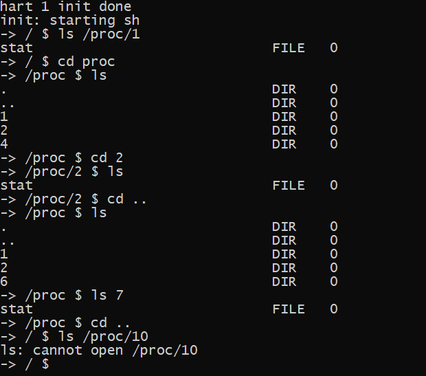

### #2 cat

> 2022-08-25
>
> Implement：实现/proc虚拟文件系统以及命令`cat /proc/[pid]/stat`。
>
> 思路：根据`cat`命令的函数调用路径分析，通过文件系统读取存储于磁盘中文件信息时，会最终通过将文件目录的`dirent`传给`eread`函数，`eread`函数通过调用`rw_clus`函数读取磁盘中的相应内容然后返回。而对于`/proc`虚拟文件系统，只需要在`eread`的时候根据进程的状态实时生成文件内容并返回。因此通过在dirent结构体上增加成员变量`dirent_function`，使得文件系统在调用`eread`函数时通过该变量来调用，在为`/proc`文件夹下子目录及其文件分配`dirent`时将该变量所指向的函数重定向为新定义的`procfs_eread`函数。

- 在fat32.h中新增定义结构体`dirent_function`，并在结构体dirent中增加成员变量`e_func`，然后修改系统中对`eread`的调用。在文件系统初始化或分配`dirent`时初始化`dirent`的`e_func`。

  - ```c
    //fat32.h 增加结构体和变量
    struct dirent_functions {  
        int (*eread)(struct dirent*, int, uint64, uint, uint);     // read from file contents
    };
    struct dirent {
        ...
        struct dirent_functions *e_func;
    };
    //file.c 修改eread调用
    int fileread(struct file *f, uint64 addr, int n)
    {
      ...
              if((r = f->ep->e_func->eread(f->ep, 1, addr, f->off, n)) > 0)
                f->off += r;
      ...
    }
    //exec.c
    static int loadseg(pagetable_t pagetable, uint64 va, struct dirent *ep, uint offset, uint sz)
    {
        ...
        if(ep->e_func->eread(ep, 0, (uint64)pa, offset+i, n) != n)
        ...
    }
    int exec(char *path, char **argv)
    {
        ...
        if(ep->e_func->eread(ep, 0, (uint64) &elf, 0, sizeof(elf)) != sizeof(elf))
      	...
        if(ep->e_func->eread(ep, 0, (uint64)&ph, off, sizeof(ph)) != sizeof(ph))
        ...
    }
    //fat32.c 初始化e_func
    int fat32_init()
    {
        ...
        root.e_func = &fs_e_func;
        ...
    }
    static struct dirent *eget(struct dirent *parent, char *name)
    {
        ...
        for (ep = root.prev; ep != &root; ep = ep->prev) {              // LRU algo
            if (ep->ref == 0) {
                ...
                if(parent)
                    ep->e_func = parent->e_func;
                else
                    ep->e_func = &fs_e_func;
                ...
            }
        }
        ...
    }
    //在为/proc目录下的子目录或文件分配dirent时重定向e_func，详见上个代码块
    static struct dirent *lookup_path(char *path, int parent, char *name)
    {
        ...
        
                        tmp->e_func = &procfs_e_func;
        ...
                    tmp->e_func = &procfs_e_func;
        ...
                    tmp->e_func = &procfs_e_func;
        ...
    }
    ```

- 实现`procfs_eread`函数

  - ```c
    //fat32.h
    int             procfs_eread(struct dirent*, int, uint64, uint, uint);
    //fat32.c
    int procfs_eread(struct dirent *entry, int user_dst, uint64 dst, uint off, uint n)
    {	//若是dir则直接返回
        if (off > entry->file_size || off + n < off || (entry->attribute & ATTR_DIRECTORY)) {
            return 0;
        }
        int pid = 0;
        int len = 0;
        pid = atoi(entry->parent->filename);
        if(pid > 0)
        {
            char buf[512];
            proc_read(pid,buf);
            len = strlen(buf);
            either_copyout(user_dst,dst,buf,len); //proc.c,将文件信息最终传到用户态进行打印
        }
        return len;
    }
    //proc.c:辅助函数proc_read，此处没有实现相关信息的单位转换
    void proc_read(int pid, char* s)
    {
      struct proc *p;
      for(p = proc; p < &proc[NPROC]; p++) {
        if(pid == p->pid)
        {
          break;
        }
      }
      s[0] = '\0';
      strcat(s,"pid\tcommand\t\tstate\t\tppid\tutime\tstime\tcutime\tcstime\tvsz\n");
      char tmp[128];
      itoa(p->pid,tmp);
      strcat(s,tmp);
      strcat(s,"\t");
      strcat(s,p->name);
      strcat(s,"\t\t");
      if(p->state == UNUSED){
        strcat(s,"UNUSED\t\t");
      }else if(p->state == SLEEPING){
        strcat(s,"SLEEPING\t");
      }else if(p->state == RUNNABLE){
        strcat(s,"RUNNABLE\t");
      }else if(p->state == RUNNING){
        strcat(s,"RUNNING\t\t");
      }else{
        strcat(s,"ZOMBIE\t\t");
      }
      if(p->pid == 1)
        p->parent->pid = 0;
      itoa(p->parent->pid,tmp);
      strcat(s,tmp);
      strcat(s,"\t");
      itoa(p->proc_tms.utime,tmp);
      strcat(s,tmp);
      strcat(s,"\t");
      itoa(p->proc_tms.stime,tmp);
      strcat(s,tmp);
      strcat(s,"\t");
      itoa(p->proc_tms.cutime,tmp);
      strcat(s,tmp);
      strcat(s,"\t");
      itoa(p->proc_tms.cstime,tmp);
      strcat(s,tmp);
      strcat(s,"\t");
      itoa(p->sz,tmp);
      strcat(s,tmp);
      strcat(s,"\n");
    }
    ```

- 编译运行

  - 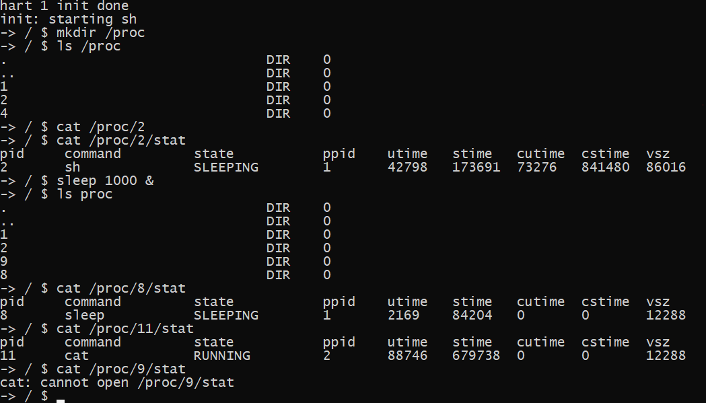

### [Bonus]#3 mount


## Task 5: Implement the `ps` command

> 2022-08-26
>
> 实现思路：通过增加系统调用，返回ps命令执行时系统中正在运行的进程信息。

### syscall# procps

- 在xv6-user目录下

  - 在user.h文件中，添加新系统调用封装后的函数声明，假设其函数名为`getppid`。

    - ```c
      int procps(struct procinfo*);
      ```

  - 在usys.pl文件末尾，添加如下行：

    - ```perl
      entry("procps");
      ```

- 在kernel目录下

  - 在include/sysnum.h文件中，添加新系统调用号的宏定义：

    - ```c
      #define SYS_procps     33
      ```

    - 其中，33为新的合法系统调用号

  - 在syscall.c文件中，添加功能函数的声明，并更新系统调用表：

    - ```c
      extern uint64 sys_procps(void);
      
      static uint64 (*syscalls[])(void) = {
          ......
          [SYS_procps]    sys_procps,
      };
      
      static char *sysnames[] = {
          ......
          [SYS_procps]     "procps",
      };
      ```

  - 定义相关结构体和辅助函数

    - 新建`ps.h`文件，定义用于存储进程信息的结构体`struct procinfo`以及用于根据命令行参数设置输出标志的宏

      ```h
      #ifndef __PS_H
      #define __PS_H
      
      #include "types.h"
      #include "times.h"
      
      #define PS_PID		0x01
      #define PS_PPID		0x02
      #define PS_COMMAND	0x04
      #define PS_S 		0x08
      #define PS_TIME		0x10
      #define PS_ELAPSED  0x20
      #define PS_VSZ		0x40
      
      struct procinfo {
      	int pid;
      	int ppid;
      	char command[16];
      	char state;
      	uint64 times;
      	uint64 etime;
      	int vsz;
      };
      
      #endif
      ```

    - 在进程控制结构体中增加成员变量`starttime`，用于记录进程被创建并开始运行的系统时间（用系统的ticks），并在进程被创建时进行初始化。

      ```c
      //proc.h
      struct proc {
        ...
        uint64 starttime;
        ...
      }
      //proc.c
      int fork(void)
      {
          ...
          acquire(&tickslock);
        	np->starttime = ticks;
        	release(&tickslock); 
        	release(&np->lock);
          return pid;
      }
      ```

    - `proc_ps`：用于读取指定`pid`的进程的信息

      ```c
      //proc.h
      void            proc_ps(int, struct procinfo*);
      //proc.c
      void proc_ps(int pid, struct procinfo* pi)
      {
        struct proc *p;
        for(p = proc; p < &proc[NPROC]; p++) {
          if(pid == p->pid)
            break;
        }
        pi->pid = p->pid;
        pi->ppid = p->parent->pid;
        if(p->pid == 1)//对于init进程，特殊处理
          pi->ppid = 0;
        pi->command[0] = '\0';
        strcat(pi->command, p->name);
        if(p->state == SLEEPING)//ps的进程只有三种状态，SLEEPING,RUNNING,RUNNABLE
          pi->state = 'S';
        else
          pi->state = 'R';
        pi->times = p->proc_tms.stime + p->proc_tms.utime;
        acquire(&tickslock);
        pi->etime = ticks - p->starttime;
        release(&tickslock);
        pi->vsz = p->sz;
      }
      ```

  - 在sysproc.c文件中，实现`sys_procps`函数的功能如下：

    - ```c
      uint64 sys_procps(void)
      {
        uint64 addr;
        if(argaddr(0, &addr) < 0)
          return -1;
        int pids[NPROC];
        struct procinfo pinfo[NPROC];
        int i;
        uint64 len = 0;
        int cnt = getPids(pids); //获取进程pid
        for(i = 0; i < cnt; i++)
        {
          proc_ps(pids[i],&pinfo[i]);//读pid指定的进程信息
          len += sizeof(pinfo[i]);
        }
        copyout2(addr,(char*)pinfo,len);
        return cnt;
      }
      ```

- 在xv6-user目录下

  - 创建ps.c文件，编写系统调用`procps`的测试函数

    - 声明相关头文件
    
      ```c
      #include "kernel/include/types.h"
      #include "kernel/include/param.h"
      #include "kernel/include/ps.h"
      #include "xv6-user/user.h"
      ```
    
    - 打印`ps`命令的用法提示信息
    
      ```c
      void print_usage()
      {
      	printf("\nUsages:\n");
      	printf("Try \"-> / $ ps\"\n");
      	printf("Or  \"-> / $ ps -o pid,ppid,comm,state,time,etime,vsz (7 fields: optional)\"\n");
      }
      ```
    
    - 解析输入的命令行参数设置标记位，如果检测到参数有误，直接打印出错误参数提示信息并退出程序
    
      ```c
      int setflag(char* tmp, int n)
      {
      	int flag = n;
      	if(strncmp(tmp,"pid",6) == 0)
      	{
      		flag |= PS_PID;
      	}
      	else if(strncmp(tmp,"ppid",6) == 0)
      	{
      		flag |= PS_PPID;
      	}
      	else if(strncmp(tmp,"comm",6) == 0)
      	{
      		flag |= PS_COMMAND;
      	}
      	else if(strncmp(tmp,"state",6) == 0)
      	{
      		flag |= PS_S;
      	}
      	else if(strncmp(tmp,"time",6) == 0)
      	{
      		flag |= PS_TIME;
      	}
      	else if(strncmp(tmp,"etime",6) == 0)
      	{
      		flag |= PS_ELAPSED;
      	}
      	else if(strncmp(tmp,"vsz",6) == 0)
      	{
      		flag |= PS_VSZ;
      	}
      	if(flag == n)
      	{
      		printf("error: unknown user-defined format specifier \"%s\"\n",tmp);
      		print_usage();
      		exit(0);
      	}
      	return flag;
      }
      ```
    
    - 解析命令行参数
    
      ```c
      int parse_arg(char *arg)
      {
      	int flag = 0;
      	char* ptr;
      	char tmp[6];
      	while((ptr = strchr(arg,',')) != NULL)
      	{
      		int len = ptr-arg;
      		strncpy(tmp,arg,len);//逐一提取参数中的每个信息量
      		tmp[len] = '\0';
      		flag = setflag(tmp,flag);//设置标志位
      		arg = ptr + 1;
      	}
      	flag = setflag(arg,flag);
      	return flag;
      }
      ```
    
    - 将时间格式化：从ticks传化为`00:00:00`形式
    
      ```c
      void format_time(char* times, uint64 ticks)
      {
      	if(ticks)
      		ticks /= TICKS_FREQ;//TICKS_FREQ在param.h中定义，表示为每秒的ticks数
      	int hh,mm,ss;
      	char tmp[3];
      	ss = ticks % 60;
      	ticks /= 60;
      	mm = ticks % 60;
      	hh = ticks / 60;
      	times[0] = '\0';
      	itoa(hh,tmp);
      	if(hh >= 10){
      		strcat(times,tmp);
      	}else{
      		strcat(times,"0");
      		strcat(times,tmp);
      	}
      	strcat(times,":");
      	itoa(mm,tmp);
      	if(mm >= 10){
      		strcat(times,tmp);
      	}else{
      		strcat(times,"0");
      		strcat(times,tmp);
      	}
      	strcat(times,":");
      	itoa(ss,tmp);
      	if(ss >= 10){
      		strcat(times,tmp);
      	}else{
      		strcat(times,"0");
      		strcat(times,tmp);
      	}
      }
      ```
    
    - 根据标志位打印ps输出结果的首行信息
    
      ```c
      void print_hint(int flag)
      {
      	if(flag & PS_PID)
      	{
      		printf("PID\t");
      	}
      	if(flag & PS_PPID)
      	{
      		printf("PPID\t");
      	}
      	if(flag & PS_COMMAND)
      	{
      		printf("COMMAND\t");
      	}
      	if(flag & PS_S)
      	{
      		printf("S\t");
      	}
      	if(flag & PS_TIME)
      	{
      		printf("TIME\t\t");
      	}
      	if(flag & PS_ELAPSED)
      	{
      		printf("ELAPSED\t\t");
      	}
      	if(flag & PS_VSZ)
      	{
      		printf("VSZ");
      	}
      	printf("\n");
      }
      ```
    
    - 根据解析命令行参数时设置的标志位输出指定的进程信息
    
      ```c
      void print_res(struct procinfo *p, int flag)
      {
      	if(flag & PS_PID)
      	{
      		printf("%d\t",p->pid);
      	}
      	if(flag & PS_PPID)
      	{
      		printf("%d\t",p->ppid);
      	}
      	if(flag & PS_COMMAND)
      	{
      		printf("%s\t",p->command);
      	}
      	if(flag & PS_S)
      	{
      		printf("%c\t",p->state);
      	}
      	if(flag & PS_TIME)
      	{
      		char tm[10];
      		format_time(tm,p->times);
      		printf("%s\t",tm);
      	}
      	if(flag & PS_ELAPSED)
      	{
      		char tm[10];
      		format_time(tm,p->etime);
      		printf("%s\t",tm);
      	}
      	if(flag & PS_VSZ)
      	{
      		printf("%d",p->vsz/1024);
      	}
      	printf("\n");
      }
      ```
    
    - 测试main函数
    
      ```c
      int main(int argc, char *argv[])
      {
      	if(argc > 1 && argc != 3)
      	{
      		print_usage();
      		exit(0);
      	}
      	int flag = 0x7f;//“ps”，输出所有信息
      	if(argc == 3)//解析命令行参数
      	{
      		if(strncmp(argv[1],"-o",3) != 0)
      		{
      			print_usage();
      			exit(0);
      		}
      		flag = parse_arg(argv[2]);//解析命令行并设置标志位
      	}
      	struct procinfo pi[NPROC];
      	int cnt = 0;
      	if((cnt = procps(pi)) > 0)
      	{
      		print_hint(flag);//输出首行
      		int i;
      		for(i = 0; i < cnt; i++)
      		{
      			print_res(&pi[i],flag);//输出进程信息
      		}
      	}
      	exit(0);
      }
      ```

- 在根目录下

  - 在Makefile文件中加一行如下：

    - ```makefile
      UPROGS=\
          $U/_init\
          $U/_sh\
          $U/_cat\
          ...
          $U/_ps\
      ```

- 编译运行

  - 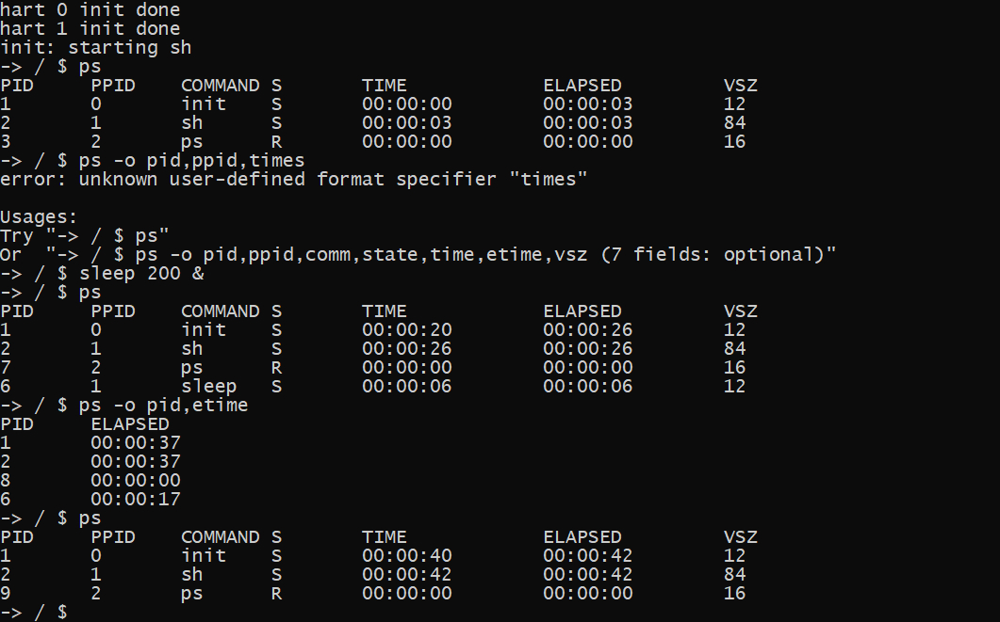

> 2022-08-31
>
> 思路二：基于实现的/proc虚拟文件系统，首先打开/proc目录（类似于ls命令），然后依次读取该目录下各进程的文件信息（类似于cat命令），最后整合信息并输出。同时增加系统调用getelapsed来获取进程的总时间。

- 在xv6-user目录下

  - 在user.h文件中，添加新系统调用封装后的函数声明，假设其函数名为`getppid`。

    - ```c
      int getelapsed(int);
      ```

  - 在usys.pl文件末尾，添加如下行：

    - ```perl
      entry("getelapsed");
      ```

- 在kernel目录下

  - 在include/sysnum.h文件中，添加新系统调用号的宏定义：

    - ```c
      #define SYS_getelapsed     34
      ```

    - 其中，34为新的合法系统调用号

  - 在syscall.c文件中，添加功能函数的声明，并更新系统调用表：

    - ```c
      extern uint64 sys_getelapsed(void);
      
      static uint64 (*syscalls[])(void) = {
          ......
          [SYS_getelapsed]    sys_getelapsed,
      };
      
      static char *sysnames[] = {
          ......
          [SYS_getelapsed]     "getelapsed",
      };
      ```

  - 在sysproc.c文件中，实现`sys_getelapsed`函数的功能如下：

    - ```c
      uint64 sys_getelapsed(void)
      {
        uint64 pid;
        if(argint(0,&pid) < 0)
          return -1;
        return proc_elapsed(pid);
      }
      ```

  - 在proc.c文件中，定义`proc_elapsed`函数如下：

    - ```c
      int proc_elapsed(int pid)
      {
        struct proc *p;
        for(p = proc; p < &proc[NPROC]; p++) {
          if(pid == p->pid)
          {
            break;
          }
        }
        acquire(&tickslock);
        uint64 temp = ticks - p->starttime;
        release(&tickslock);
        return temp;
      }
      ```

- 在xv6-user目录下

  - 创建pstest.c文件，编写ps的测试函数

    - 解析由read系统调用返回的进程信息

      - ```c
        void parse_res(char* str,struct procinfo *p)
        {
        	char tmp[20];
        	char *ptr1 = strchr(str,'\n');
        	char *ptr2 = strchr(ptr1,'\t');
        	ptr1 += 1;
        	//pid
        	int len = ptr2-ptr1;
        	strncpy(tmp,ptr1,len);
        	tmp[len] = '\0';
        	p->pid = atoi(tmp);
        	ptr2 += 1;
        	//name
        	ptr1 = strchr(ptr2,'\t');
        	len = ptr1-ptr2;
        	strncpy(p->command,ptr2,len);
        	p->command[len]='\0';
        	ptr1 += 2;
        	//state
        	ptr2 = strchr(ptr1,'\t');
        	len = ptr2 - ptr1;
        	strncpy(tmp,ptr1,len);
        	p->state = tmp[0];
        	ptr2 += 1;
        	//ppid
        	ptr1 = strchr(ptr2,'\t');
        	len = ptr1 - ptr2;
        	strncpy(tmp,ptr2,len);
        	tmp[len] = '\0';
        	p->ppid = atoi(tmp);
        	ptr1 += 1;
        	//time
        	uint64 utime,stime;
        	ptr2 = strchr(ptr1,'\t');
        	len = ptr2 - ptr1;
        	strncpy(tmp,ptr1,len);
        	tmp[len] = '\0';
        	utime = atoi(tmp);
        	ptr2 += 1;
        
        	ptr1 = strchr(ptr2,'\t');
        	len = ptr1 - ptr2;
        	strncpy(tmp,ptr2,len);
        	tmp[len] = '\0';
        	stime = atoi(tmp);
        	ptr1 += 1;
        
        	p->times = utime + stime;
        
        	ptr2 = strchr(ptr1,'\t');
        	ptr2 += 1;
        	ptr1 = strchr(ptr2,'\t');
        	ptr1 += 1;
        	//vsz
        	ptr2 = strchr(ptr1,'\n');
        	len = ptr2 - ptr1;
        	strncpy(tmp,ptr1,len);
        	tmp[len] = '\0';
        	p->vsz = atoi(tmp);
        	//etime
        	p->etime = getelapsed(p->pid);
        }
        ```

    - 编写测试函数

      - ```c
        int main(int argc, char *argv[])
        {
        	if(argc > 1 && argc != 3)
        	{
        		print_usage();
        		exit(0);
        	}
        	int flag = 0x7f;
        	if(argc == 3)
        	{
        		if(strncmp(argv[1],"-o",3) != 0)
        		{
        			print_usage();
        			exit(0);
        		}
        		flag = parse_arg(argv[2]);
        	}
        	struct stat st;
        	struct procinfo pi[NPROC];
        	int cnt = 0;
        	int fd;
        	if((fd = open("/proc", 0)) < 0){//打开/proc目录
            	fprintf(2, "ls: cannot open %s\n", "/proc");
            	exit(0);
          	}
        	fstat(fd, &st);
          	char buf[512];
          	int n;
          	while(readdir(fd, &st) == 1){//逐一读取/proc目录下的目录项
          		int fd1;
              	if(st.name[0] > '0' && st.name[0] <= '9')
              	{
              		char path[20];
              		path[0] = '\0';
              		strcat(path,"/proc/");
              		strcat(path,st.name);
              		strcat(path,"/stat");
              		if((fd1 = open(path, 0)) < 0){//读取各进程的文件信息
        		      fprintf(2, "cat: cannot open %s\n", path);
        		      exit(1);
            		}
            		if((n = read(fd1, buf, sizeof(buf))) > 0) {
        			    parse_res(buf,&pi[cnt]);
        			}
              		cnt++;
              	}
            }
        	print_hint(flag);
        	int i;
        	for(i = 0; i < cnt; i++)
        	{
        		print_res(&pi[i],flag);
        	}
        	exit(0);
        }
        ```

    - 其他辅助函数同上

- 在根目录下

  - 在Makefile文件中加一行如下：

    - ```makefile
      UPROGS=\
          $U/_init\
          $U/_sh\
          $U/_cat\
          ...
          $U/_pstest\
      ```

- 编译运行

  - 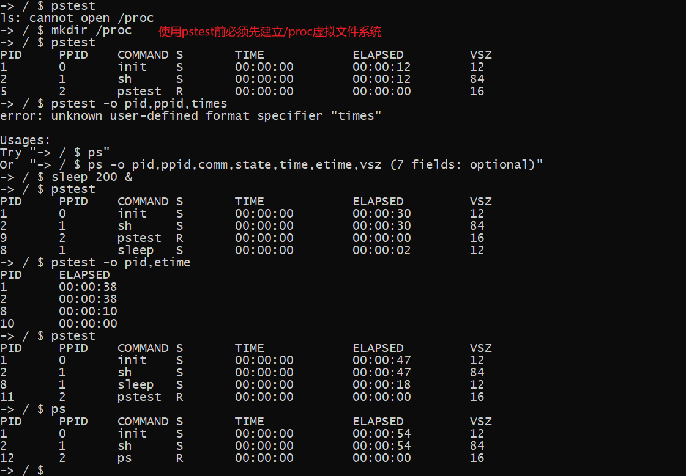

------

